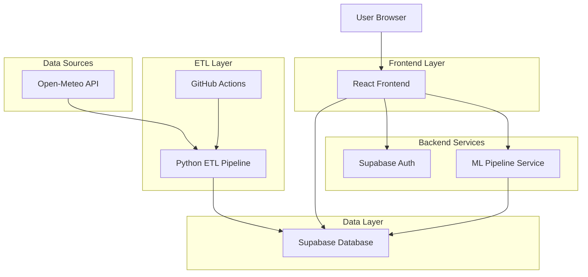
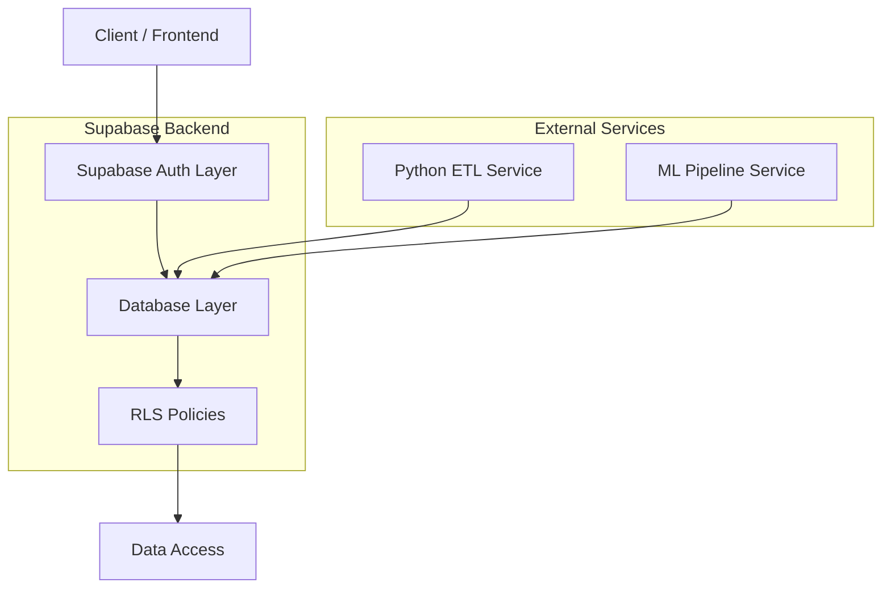
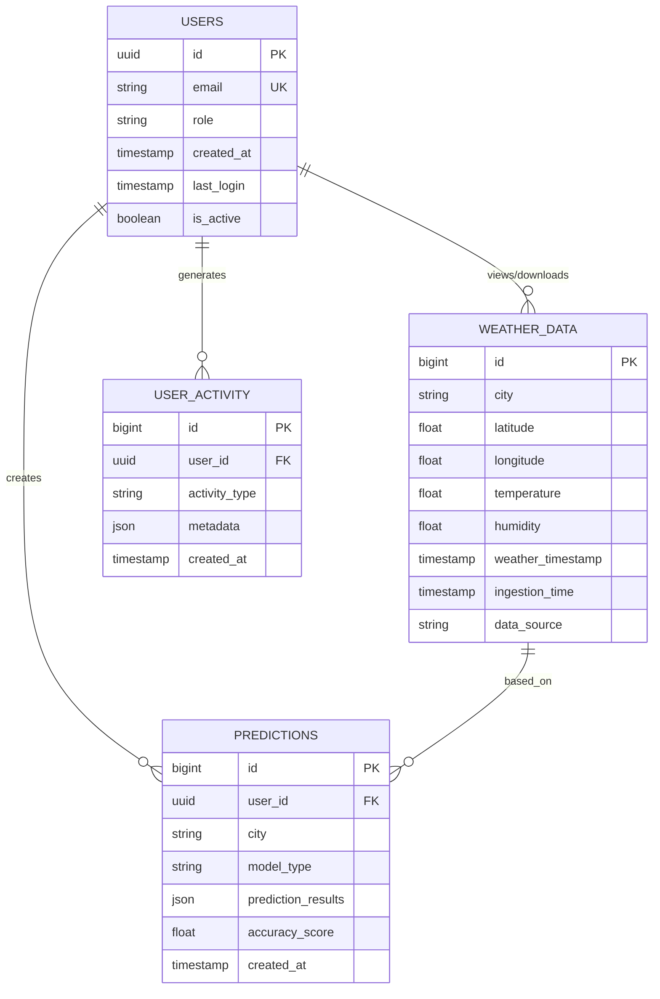

## 1. Architecture design



## 2. Technology Description

- **Frontend**: React@18 + TypeScript + TailwindCSS@3 + Vite
- **Initialization Tool**: vite-init
- **Backend**: Supabase (PostgreSQL, Auth, Storage)
- **ETL Pipeline**: Python@3.10+ + requests + pandas + python-dotenv
- **ML Pipeline**: scikit-learn + tensorflow + shap + lime
- **CI/CD**: GitHub Actions
- **Monitoring**: Supabase Analytics + Custom Event Tracking

## 3. Route definitions

| Route | Purpose |
|-------|---------|
| / | Login page, autenticación de usuarios |
| /register | Registro de nuevos visualizadores |
| /dashboard | Dashboard principal para visualizadores |
| /admin | Panel de administración completo |
| /predictions | Página de modelos predictivos y XAI |
| /downloads | Centro de descarga de datasets |
| /profile | Configuración de perfil de usuario |

## 4. API definitions

### 4.1 Authentication APIs

```
POST /auth/v1/token
```

Request:
| Param Name | Param Type | isRequired | Description |
|------------|-------------|-------------|-------------|
| email | string | true | Email del usuario |
| password | string | true | Contraseña del usuario |

Response:
| Param Name | Param Type | Description |
|------------|-------------|-------------|
| access_token | string | JWT token para autenticación |
| refresh_token | string | Token para renovar sesión |
| user | object | Datos del usuario autenticado |

### 4.2 Weather Data APIs

```
GET /rest/v1/weather_data
```

Query Parameters:
| Param Name | Param Type | isRequired | Description |
|------------|-------------|-------------|-------------|
| city | string | false | Filtrar por ciudad |
| start_date | string | false | Fecha inicial (ISO 8601) |
| end_date | string | false | Fecha final (ISO 8601) |
| limit | number | false | Límite de resultados (max 1000) |

### 4.3 ML Prediction APIs

```
POST /functions/v1/predict-temperature
```

Request:
| Param Name | Param Type | isRequired | Description |
|------------|-------------|-------------|-------------|
| city | string | true | Ciudad para predecir |
| days_ahead | number | true | Días a predecir (1-7) |
| model_type | string | false | Tipo de modelo ('linear', 'random_forest', 'lstm') |

## 5. Server architecture diagram



## 6. Data model

### 6.1 Data model definition



### 6.2 Data Definition Language

**Users Table (users)**
```sql
-- create table
CREATE TABLE users (
    id UUID PRIMARY KEY DEFAULT gen_random_uuid(),
    email VARCHAR(255) UNIQUE NOT NULL,
    role VARCHAR(20) NOT NULL DEFAULT 'visualizador' CHECK (role IN ('admin', 'visualizador')),
    created_at TIMESTAMP WITH TIME ZONE DEFAULT NOW(),
    last_login TIMESTAMP WITH TIME ZONE,
    is_active BOOLEAN DEFAULT true
);

-- enable RLS
ALTER TABLE users ENABLE ROW LEVEL SECURITY;

-- create policies
CREATE POLICY "Users can view own profile" ON users FOR SELECT USING (auth.uid() = id);
CREATE POLICY "Admin can view all users" ON users FOR SELECT USING (auth.jwt() ->> 'role' = 'admin');
```

**Weather Data Table (weather_data)**
```sql
-- create table
CREATE TABLE weather_data (
    id BIGSERIAL PRIMARY KEY,
    city VARCHAR(100) NOT NULL,
    latitude DECIMAL(8,6) NOT NULL,
    longitude DECIMAL(9,6) NOT NULL,
    temperature DECIMAL(5,2) NOT NULL,
    humidity DECIMAL(5,2) NOT NULL,
    weather_timestamp TIMESTAMP WITH TIME ZONE NOT NULL,
    ingestion_time TIMESTAMP WITH TIME ZONE DEFAULT NOW(),
    data_source VARCHAR(50) DEFAULT 'open-meteo'
);

-- create indexes
CREATE INDEX idx_weather_data_city ON weather_data(city);
CREATE INDEX idx_weather_data_timestamp ON weather_data(weather_timestamp);
CREATE INDEX idx_weather_data_ingestion ON weather_data(ingestion_time);
CREATE UNIQUE INDEX idx_weather_data_unique ON weather_data(city, weather_timestamp);

-- enable RLS
ALTER TABLE weather_data ENABLE ROW LEVEL SECURITY;

-- create policies
CREATE POLICY "Anyone can view weather data" ON weather_data FOR SELECT USING (true);
CREATE POLICY "Admin can insert weather data" ON weather_data FOR INSERT USING (auth.jwt() ->> 'role' = 'admin');
```

**User Activity Table (user_activity)**
```sql
-- create table
CREATE TABLE user_activity (
    id BIGSERIAL PRIMARY KEY,
    user_id UUID REFERENCES users(id) ON DELETE CASCADE,
    activity_type VARCHAR(50) NOT NULL,
    metadata JSONB,
    created_at TIMESTAMP WITH TIME ZONE DEFAULT NOW()
);

-- create indexes
CREATE INDEX idx_user_activity_user_id ON user_activity(user_id);
CREATE INDEX idx_user_activity_type ON user_activity(activity_type);
CREATE INDEX idx_user_activity_created_at ON user_activity(created_at DESC);

-- enable RLS
ALTER TABLE user_activity ENABLE ROW LEVEL SECURITY;

-- create policies
CREATE POLICY "Users can view own activity" ON user_activity FOR SELECT USING (auth.uid() = user_id);
CREATE POLICY "Admin can view all activity" ON user_activity FOR SELECT USING (auth.jwt() ->> 'role' = 'admin');
```

**Predictions Table (predictions)**
```sql
-- create table
CREATE TABLE predictions (
    id BIGSERIAL PRIMARY KEY,
    user_id UUID REFERENCES users(id) ON DELETE CASCADE,
    city VARCHAR(100) NOT NULL,
    model_type VARCHAR(50) NOT NULL,
    prediction_results JSONB NOT NULL,
    accuracy_score DECIMAL(5,4),
    created_at TIMESTAMP WITH TIME ZONE DEFAULT NOW()
);

-- create indexes
CREATE INDEX idx_predictions_user_id ON predictions(user_id);
CREATE INDEX idx_predictions_city ON predictions(city);
CREATE INDEX idx_predictions_created_at ON predictions(created_at DESC);

-- enable RLS
ALTER TABLE predictions ENABLE ROW LEVEL SECURITY;

-- create policies
CREATE POLICY "Users can view own predictions" ON predictions FOR SELECT USING (auth.uid() = user_id);
CREATE POLICY "Admin can view all predictions" ON predictions FOR SELECT USING (auth.jwt() ->> 'role' = 'admin');
```

### 6.3 Grant Permissions
```sql
-- Grant basic read access to anon role
GRANT SELECT ON weather_data TO anon;

-- Grant full access to authenticated role
GRANT ALL PRIVILEGES ON ALL TABLES IN SCHEMA public TO authenticated;
GRANT ALL PRIVILEGES ON ALL SEQUENCES IN SCHEMA public TO authenticated;
```