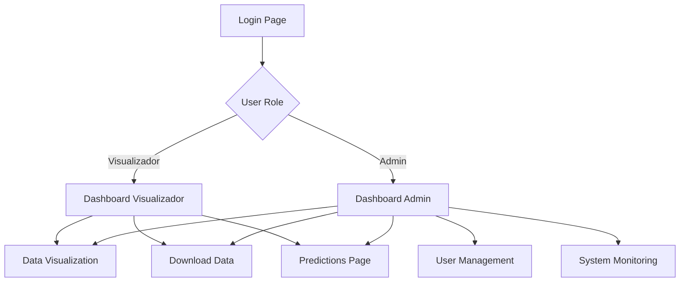

## 1. Product Overview
Plataforma end-to-end para ingestión, análisis y visualización de datos climáticos con capacidades de ML predictivo. Solución que automatiza la recolección de datos meteorológicos de 100 ciudades globales, ejecuta análisis predictivos y proporciona dashboards interactivos con control de acceso por roles.

Dirigida a equipos de ciencia de datos, meteorólogos y analistas que necesitan datos climáticos confiables con capacidades predictivas avanzadas en tiempo casi real.

## 2. Core Features

### 2.1 User Roles
| Role | Registration Method | Core Permissions |
|------|---------------------|------------------|
| Admin | Manual creation by system | Full platform access, user management, system monitoring |
| Visualizador | Self-registration with email | Access to permitted dashboards, data downloads, predictions |

### 2.2 Feature Module
Nuestra plataforma de datos climáticos consiste en las siguientes páginas principales:
1. **Login/Registro**: Autenticación de usuarios, registro obligatorio para visualizadores
2. **Dashboard Visualizador**: Visualización de datos climáticos, gráficos interactivos, descarga de datasets
3. **Dashboard Admin**: Gestión de usuarios, monitoreo de actividad, configuración del sistema
4. **Página de Predicciones**: Modelos ML/DL, resultados predictivos, interpretabilidad XAI
5. **Página de Descargas**: Exportación de datasets, resultados de modelos, reportes

### 2.3 Page Details
| Page Name | Module Name | Feature description |
|-----------|-------------|---------------------|
| Login/Registro | Formulario de autenticación | Validar credenciales, crear nuevos usuarios visualizadores, gestionar sesiones |
| Dashboard Visualizador | Panel de datos climáticos | Mostrar temperatura y humedad en tiempo real, filtros por ciudad y fecha, gráficos interactivos |
| Dashboard Visualizador | Módulo de descargas | Exportar datasets en CSV/JSON, seleccionar rangos de fecha y ciudades específicas |
| Dashboard Admin | Gestión de usuarios | Ver lista de usuarios, modificar permisos, desactivar cuentas, ver actividad reciente |
| Dashboard Admin | Monitoreo de sistema | Visualizar usuarios conectados, sesiones activas, frecuencia de uso, predicciones realizadas |
| Página de Predicciones | Modelos predictivos | Ejecutar modelos ML/DL, mostrar predicciones de temperatura, validar precisión del modelo |
| Página de Predicciones | Análisis XAI | Generar interpretabilidad con SHAP/LIME, explicar predicciones, identificar features importantes |

## 3. Core Process

### Flujo de Usuario Visualizador
El usuario visualizador accede a la plataforma, se autentica con sus credenciales, navega al dashboard principal donde puede ver datos climáticos en tiempo real, aplicar filtros por ciudad y fecha, descargar datasets específicos, acceder a predicciones del modelo y generar reportes de interpretabilidad.

### Flujo de Usuario Admin
El administrador inicia sesión con acceso completo, revisa el dashboard de monitoreo con métricas de uso del sistema, gestiona usuarios y permisos, supervisa la salud del sistema, configura actualizaciones del pipeline ETL y accede a todas las funcionalidades de visualización y predicción.

## 4. User Interface Design

### 4.1 Design Style
- **Colores primarios**: Azul oscuro (#1e40af) para headers, azul medio (#3b82f6) para elementos principales
- **Colores secundarios**: Gris claro (#f3f4f6) para fondos, verde (#10b981) para éxito, rojo (#ef4444) para errores
- **Botones**: Estilo redondeado con sombra sutil, hover effects suaves
- **Tipografía**: Inter para headers, Roboto para contenido, tamaños 14-16px base
- **Layout**: Card-based con navegación lateral, grid responsive de 12 columnas
- **Iconos**: Material Design Icons, consistencia en estilo y tamaño

### 4.2 Page Design Overview
| Page Name | Module Name | UI Elements |
|-----------|-------------|-------------|
| Login/Registro | Formulario principal | Centrado, fondo gradiente azul, card blanca con bordes redondeados, inputs con iconos, botón primario prominente |
| Dashboard Visualizador | Panel de datos | Layout de 3 columnas, cards de métricas en top, gráficos de línea interactivos, tabla de datos scrollable, filtros en sidebar |
| Dashboard Admin | Gestión usuarios | Tabla con paginación, botones de acción por fila, modal de edición, badges de estado, búsqueda y filtros avanzados |
| Página Predicciones | Resultados modelo | Split view: inputs a la izquierda, resultados a la derecha, gráficos de predicción, métricas de precisión, sección XAI desplegable |
| Página Descargas | Exportador | Selector de fechas con datepicker, checklist de ciudades, preview de datos, botón de descarga con progress indicator |

### 4.3 Responsiveness
Diseño desktop-first con adaptación mobile completa. Breakpoints: 320px (mobile), 768px (tablet), 1024px (desktop), 1440px (wide). Touch optimization para interacciones en dispositivos móviles, menús hamburguesa, cards apiladas verticalmente en mobile.