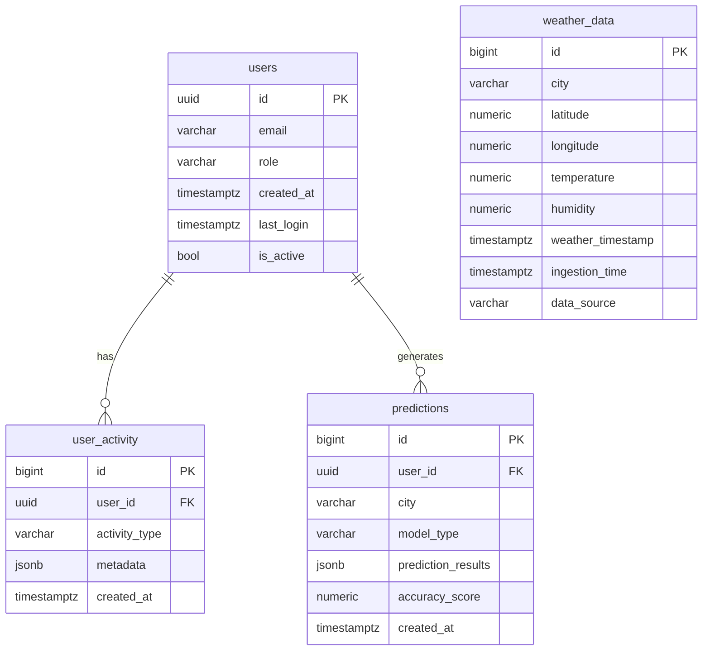

# Climate Intelligence Platform

Plataforma integral de monitoreo, análisis y predicción climática para 103 ciudades. Integra ETL en Python, modelos de ML (XGBoost/LightGBM), base de datos en Supabase y un frontend moderno con React + Vite.


  

## Objetivo

Proveer visualizaciones en tiempo real (mapas y gráficos), predicciones de temperatura y humedad a horizontes de 30/60/120 minutos, y paneles administrativos para métricas del sistema y usuarios.

---

## 1. Configuración Inicial

### Requisitos previos

- Node.js: recomendado >= 18 LTS (ver dependencias en [package.json](c:\Users\migue\OneDrive\Documents\ClimateIntelligencePlatform\package.json))
- Gestor de paquetes: npm (v10+) o pnpm/yarn equivalentes
- Cuenta y proyecto en Supabase (URL + claves)

### Variables de entorno

Configurar `.env` (no subir a control de versiones):

```env
# Supabase
SUPABASE_URL=<url_backend_supabase>
SUPABASE_ANON_KEY=<anon_key>
SUPABASE_SERVICE_ROLE_KEY=<service_role_key>

# Frontend (Vite exige prefijo VITE_)
VITE_SUPABASE_URL=<url_backend_supabase>
VITE_SUPABASE_ANON_KEY=<anon_key>
```

### Instalación

```bash
# Clonar
git clone <repo_url>
cd ClimateIntelligencePlatform

# Instalar dependencias
npm install

# Desarrollo
npm run dev

# Build producción
npm run build

# Preview local
npm run preview
```

Para entornos: definir `.env` específicos en desarrollo/staging/producción y configurar claves en los servicios de despliegue (Vercel).

---

## 2. Estructura del Proyecto

```
ClimateIntelligencePlatform/
├─ .github/                  # Workflows CI/CD (p.ej. etl.yml)
├─ .trae/                    # Documentos internos de arquitectura y PRD
├─ .vercel/                  # Metadatos de proyecto para Vercel
├─ api/                      # (Reservado) Endpoints de API serverless
├─ docs/                     # Documentación adicional (AUTHENTICATION.md)
├─ etl/                      # ETL en Python (ingestión Open-Meteo)
├─ ml_pipeline/              # Modelado ML (training, inference, evaluación)
├─ public/                   # Recursos estáticos (favicon)
├─ scripts/                  # Scripts Node (admin Supabase, verificación)
├─ src/                      # Frontend principal (React + Vite)
├─ supabase/                 # Migraciones SQL y configuración
├─ .env                      # Variables de entorno (local)
├─ .vercelignore             # Ignorar en despliegue
├─ .gitignore                # Ignorar en git
├─ index.html                # Entrada SPA
├─ package.json              # Dependencias y scripts
├─ tsconfig.json             # Configuración TS
├─ tailwind.config.js        # Tailwind
├─ postcss.config.js         # PostCSS
├─ vite.config.ts            # Configuración Vite
└─ vercel.json               # Rewrites SPA
```

### Archivos clave

- [vite.config.ts](c:\Users\migue\OneDrive\Documents\ClimateIntelligencePlatform\vite.config.ts): configuración de Vite (plugins React, Trae badge, tsconfig paths).
- [tsconfig.json](c:\Users\migue\OneDrive\Documents\ClimateIntelligencePlatform\tsconfig.json): opciones de compilación TypeScript.
- [tailwind.config.js](c:\Users\migue\OneDrive\Documents\ClimateIntelligencePlatform\tailwind.config.js): configuración de Tailwind (dark mode, paths).

---

## 3. Base de Datos (Supabase)

### Diagrama ER (Mermaid)



### Tablas y función

- `users`: perfiles de aplicación vinculados a `auth.users` (roles: `admin`, `visualizador`).
- `weather_data`: mediciones ingestas por ETL (ciudad, coords, temperatura, humedad, timestamp).
- `predictions`: resultados de inferencia ML por ciudad (JSONB con horizontes).
- `user_activity`: trazabilidad de acciones.

### RLS

- Habilitada en todas las tablas. Políticas típicas:
  - `users`: el usuario ve su perfil; `admin` puede ver todos.
  - `weather_data`: lectura pública (si se define), inserta solo `admin`/ETL.
  - `predictions`: usuario ve propias; `admin` todo. Política pública adicional en `20260105_allow_public_predictions.sql` si se desea lectura abierta.

### Triggers y funciones

- `handle_new_user`: crea fila en `public.users` al registrarse en `auth.users`.

---

## 4. Backend

El proyecto usa Supabase como BaaS. No existe servidor Node dedicado en `api/` aún; la lógica de negocio está en:

- ETL Python ([etl](c:\Users\migue\OneDrive\Documents\ClimateIntelligencePlatform\etl)): ingesta periódica y escritura en `weather_data`.
- ML Pipeline ([ml_pipeline](c:\Users\migue\OneDrive\Documents\ClimateIntelligencePlatform\ml_pipeline)): entrenamiento, validación, inferencia y escrituras en `predictions`.
- Scripts Admin ([scripts](c:\Users\migue\OneDrive\Documents\ClimateIntelligencePlatform\scripts)): `create_user.js`, `list_users.js`, `check_auth_config.js`.

### API (vía Supabase REST)

Ejemplos de requests:

```bash
# Lectura de datos meteorológicos
GET /rest/v1/weather_data?select=*

# Lectura de predicciones
GET /rest/v1/predictions?select=*
```

Los headers requieren `apikey: <anon_key>` y `Authorization: Bearer <anon_key>` o sesión JWT.

### Autenticación/Autorización

- Frontend usa `supabase-js` (`auth.signUp`, `auth.signInWithPassword`, `auth.signOut`).
- Para acceso inmediato sin confirmación de email, desactivar "Confirm Email" en Dashboard (ver [docs/AUTHENTICATION.md](c:\Users\migue\OneDrive\Documents\ClimateIntelligencePlatform\docs\AUTHENTICATION.md)).
- RBAC en frontend y rutas protegidas (`ProtectedRoute`) para rol `admin`.

---

## 5. Frontend

### Tecnologías

- React + Vite, Tailwind CSS, Recharts, React-Leaflet.

### Flujo y componentes

- `src/pages/Dashboard.tsx`: filtros, gráficos (scatter, bar, line), export.
- `src/pages/Predictions.tsx`: mapa Leaflet con tooltips ricos y cards por ciudad.
- `src/pages/Admin.tsx`: métricas de usuarios, gráficos de distribución y actividad.
- `src/components/ProtectedRoute.tsx`: guardas de ruta por rol.
- `src/components/predictions/MapTooltip.tsx`: tooltip visual integrado con el mapa.

### Estado y navegación

- React Router (`App.tsx`) define rutas y layout común.
- Estado manejado con hooks locales; se puede extender con Zustand si se requiere.

---

## 6. Despliegue y Ejecución

### Comandos

```bash
npm run dev     # entorno desarrollo
npm run build   # compilación producción
npm run preview # preview local
npm run lint    # linting
```

### Vercel

- [vercel.json](c:\Users\migue\OneDrive\Documents\ClimateIntelligencePlatform\vercel.json): reescribe todas las rutas a `index.html` para SPA.
- [.vercelignore](c:\Users\migue\OneDrive\Documents\ClimateIntelligencePlatform\.vercelignore): ignora `node_modules`, `dist`, `.git`, etc.

### CI/CD

- Workflows en [.github/workflows](c:\Users\migue\OneDrive\Documents\ClimateIntelligencePlatform\.github): por ejemplo, `etl.yml` para ejecutar ingestiones/cron.

### Entornos

- Variables en `.env` (local) y configuradas en panel de Vercel para producción.

---

## 7. Guía de Contribución

### Estilo y Lint

- [eslint.config.js](c:\Users\migue\OneDrive\Documents\ClimateIntelligencePlatform\eslint.config.js): reglas recomendadas + react-refresh.
  - Ejecutar `npm run lint` antes de abrir un PR.

### Commits

- Convención sugerida: `feat:`, `fix:`, `chore:`, `docs:`, `refactor:`.

### PRs

- Incluir descripción, capturas si aplican, y checklist de pruebas manuales.

### Roadmap

- Ver documentos en [.trae/documents](c:\Users\migue\OneDrive\Documents\ClimateIntelligencePlatform\.trae\documents) y [ml_eda_strategy.md](c:\Users\migue\OneDrive\Documents\ClimateIntelligencePlatform\ml_eda_strategy.md).

---

## 8. Anexos

- Capturas: agregar en `docs/`.
- Diagramas: mermaid en README o archivos `.md` dentro de `docs/`.
- Documentación adicional: [docs/AUTHENTICATION.md](c:\Users\migue\OneDrive\Documents\ClimateIntelligencePlatform\docs\AUTHENTICATION.md).

### Dependencias clave

- React 18, Vite 6, TypeScript 5, Tailwind 3, Supabase JS 2.

### Alternativas

- Router: Next.js (si se requiere SSR).
- Gráficos: ECharts, Victory.
- Mapas: Mapbox GL, deck.gl.

---

## 9. Seguridad y Buenas Prácticas

- **No subir** `.env` ni claves al repositorio.
- Configurar RLS y políticas en Supabase adecuadamente.
- Usar Service Role Key solo en scripts backend/admin (nunca en frontend).
- Validar inputs en formularios (emails, contraseñas mín. 6 caracteres).

---

## 10. Ejemplos de Código

### Inicialización de Supabase (frontend)

```ts
// src/lib/supabase.ts
import { createClient } from '@supabase/supabase-js';

const supabaseUrl = import.meta.env.VITE_SUPABASE_URL;
const supabaseAnonKey = import.meta.env.VITE_SUPABASE_ANON_KEY;

export const supabase = createClient(supabaseUrl!, supabaseAnonKey!);
```

### Carga paginada de datos (evita límites de 1000)

```ts
// Ejemplo en Dashboard.tsx
const CHUNK = 1000;
let from = 0;
const all: any[] = [];
let more = true;

while (more) {
  const { data } = await supabase.from('weather_data').select('*').range(from, from + CHUNK - 1);
  if (!data || data.length === 0) more = false; else {
    all.push(...data);
    from += CHUNK;
    if (data.length < CHUNK) more = false;
  }
}
```

### Ruta protegida por rol

```tsx
// src/components/ProtectedRoute.tsx
<Route element={<ProtectedRoute requiredRole="admin" />}> 
  <Route path="/admin" element={<Admin />} />
</Route>
```

---

## Licencia

MIT © 2026

